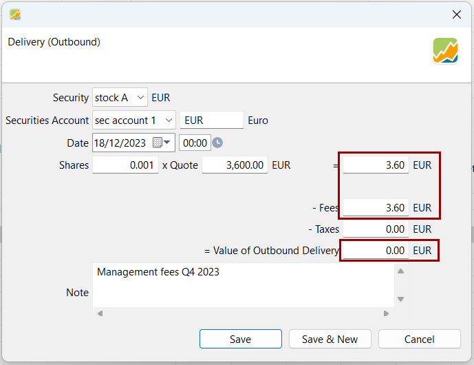
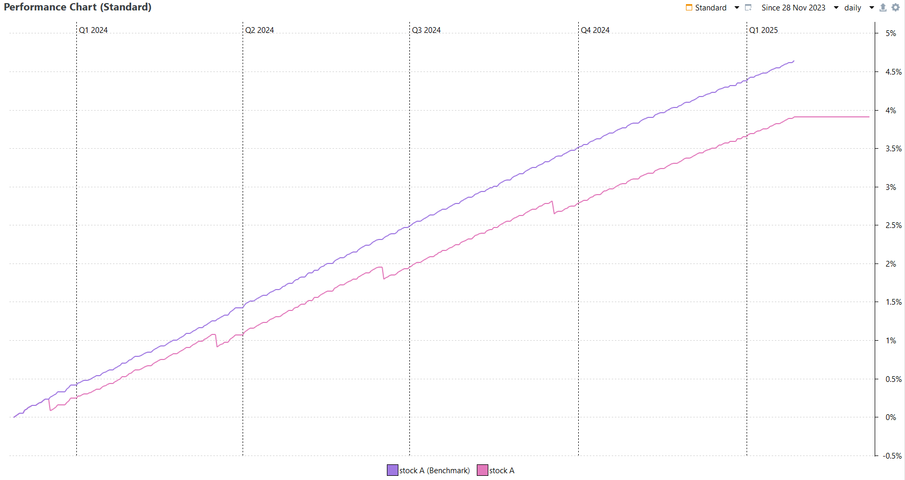
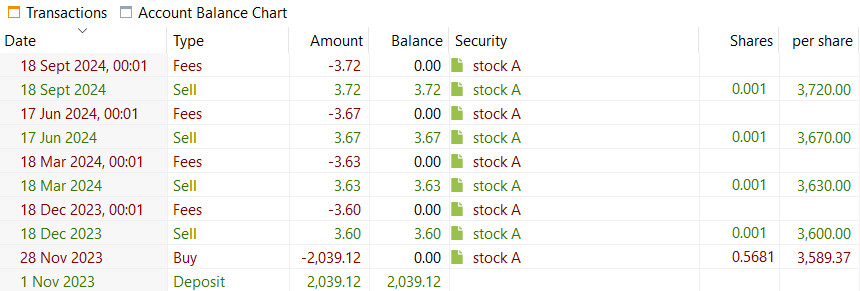

In addition of transactions fees, some brokers apply management fees, typically an annual percent of the portfolio value. In such cases, you see a reduction in the number of shares that you own as the broker sells a small amount of your shares as fees.

This is therefore essentially a sell transaction followed by a fee transaction. This can be booked in a single transaction through an [*Outbound Delivery*](../reference/transaction/delivery.md) selling the shares and applying the fees on the sold value in the same transaction, **giving a total outbound delivery amount of 0**. 

Figure: Outbound Delivery used to book the fee transaction. {class= pp-figure}

To accurately book those fees, it is important that your broker details the number of sold shares.

!!! Note
    This can be done in an [*Outbound Delivery*](../reference/transaction/delivery.md) and not in a [*Sell*](../reference/transaction/buy-sell.md) as Sell transaction in Portfolio Performance can not have a final null value.

!!! info "Practical use"
	This is therefore with this methodology that fees on *Unités de Comptes* of French *assurances-vies* can be booked.

### Example
In this example, let's consider that 0.5671 shares of `stock-A` are owned through a broker applying an annual 0.75 % management fees, taken 4 times a year : 0.75 % / 4 = 0.1875 % fees applied each quarter, on December 19, March 18, June 17 and Septembre 18.

The first quaterly fees on `stock-A` consist in a sell of `0.75/100/4 * 0.5671 = 0.001` shares, whose sold value is taken as fees.
And again on March 18 :
`0.75/100/4 * 0.5661 = 0.001` shares are sold by the broker and the sold value is taken as fees. Same for the other dates.

Figure: Several fees transactions booked as Outbound Delivery. {class= pp-figure}

The [Performance Chart](../reference/view/reports/performance/performance-chart.md) shows us the impact that those fees have : compared to the price performance of `stock-A`, our `stock-A` performance is indeed 0.75 % less than than its benchmark over a year.

Figure: Difference in performance due to the management fees. {class= pp-figure}

### Second method
This could also be done by separating the Sell and the Fee transactions by using:

1. First a [*Sell*](../reference/transaction/buy-sell.md) transaction
2. Second a [*Fees*](../reference/transaction/fees-taxes.md) transaction on the cash account, related to the sold security.

but this creates two transactions and forces to use a cash account.

Figure: List of transaction with this second method. {class= pp-figure}

